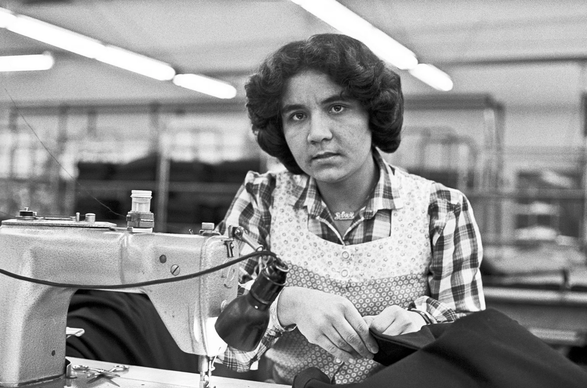

Eine migrantische Näherin bei ihrer Arbeit in einer Textilfabrik in Alsdorf bei Aachen, 1980. © Kenter, Muhlis (o.J.): „Früher hießen wir Gastarbeiter." In: Museum für Kunst & Gewerbe Hamburg, https://www.mkg-hamburg.de/ausstellungen/frueher-hiessen-wir-gastarbeiter (31.03.2026).

Erinnern wir uns an die sogenannten *Gastarbeitenden*[^1], kommen uns Bilder von türkischen oder italienischen Männern im Bergbau oder in Fabrikhallen in den Sinn. Schließlich auch deshalb, weil tradierte Rollenvorstellungen des binären Geschlechtersystems beeinflussen, wie wir über Arbeit denken und sie wahrnehmen. Das klassische Ernährer-Modell sieht den Mann als Hauptverdiener und die Frau für Hausarbeit und Kindererziehung vor. Verschleiert bleibt dabei, dass auch Frauen und Mütter im Zuge des Anwerbeabkommens der Bundesrepublik Deutschland ihre Heimat verließen, um in Deutschland einer Erwerbstätigkeit nachzugehen. Doch wer waren diese Frauen[^2]? Wenn im Folgenden über die *Gastarbeiterin* die Rede ist, geht es nicht etwa um eine bestimmte Person aus einem bestimmten Land, sondern um einen politisch geladenen Sammelbegriff.[^3]

Unter <a href="Gastarbeiterinnen.qmd" style="font-weight:bold; text-decoration:none; color:#B932F0;">GASTARBEITERINNEN</a> wird zunächst eine auf der Frauen- und Geschlechterforschung basierende Literaturrecherche zur Geschichte der *Gastarbeiterin* historisch nachskizziert. Im Mittelpunkt stehen die Verschränkungen der Kategorien Geschlecht, Arbeit und Ethnie.

<a href="Erinnern.qmd" style="font-weight:bold; text-decoration:none; color:#B932F0;">ERINNERN</a> legt ein gedächtnistheoretisches Fundament. Ausgehend vom sozialen Gedächtnis nach Maurice Halbwachs werden vergeschlechtlichte und hegemoniale Muster des Erinnerns und Vergessens sowie das Web als zeitgenössisches Gedächtnismedium beleuchtet.

Die <a href="Webrecherche.qmd" style="font-weight:bold; text-decoration:none; color:#B932F0;">WEBSUCHE</a> bildet eine webbasierte Sichtbarkeitsanalyse darüber, wie viel über die *Gastarbeiterin* im Web auffindbar ist. Der Fokus liegt dabei auf einer Auswahl von zehn institutionellen Webseiten aus den Bereichen: Gewerkschaften, politische Stiftungen und politische Bildung. Mithilfe einer Google-Strategiesuche werden diese nach vier Suchbegriffen durchsucht.

Schließlich findet unter <a href="Archivpraktik.qmd" style="font-weight:bold; text-decoration:none; color:#B932F0;">ARCHIVPRAKTIK</a> eine Archivierungsanalyse statt. Die Wayback Machine des Internet Archives dient dabei als Instrument, um Daten aus einem qualitativ kuratierten Untersuchungskorpus zu ermitteln. Dabei steht im Zentrum, ob und wie regelmäßig ausgewählte Artikel archiviert wurden.

Internetarchivierungen tragen dazu bei, Informationen aus dem Web für die Zukunft zu konservieren. Deswegen steht im Zentrum dieser Webseite die Forschungsfrage:

> Erinnert sich das deutsche institutionelle Web-Gedächtnis an die *Gastarbeiterinnen*?

[^1]: Die amtliche Bezeichnung lautet „ausländische Arbeitnehmer:in". Politisch und öffentlich etablierte sich aber der Begriff *Gastarbeiter:in* aufgrund der Wunschvorstellung, die ausländischen Arbeitskräfte würden nach einer geraumen Zeit wieder in ihre Heimatsländer zurückkehren. Aus den Gästen wurden letztlich Einwanderer:innen. Da die Gastarbeit das Werden Deutschlands als Einwanderungsland historisch datiert und geprägt hat, wird die (Fremd-)Bezeichnung *Gastarbeiter:in* in kursiv beibehalten.

[^2]: Die Untersuchung widmet sich bewusst der Geschlechterkategorie Frau. Eine Suche nach queeren *Gastarbeitenden* wäre spannend gewesen, allerdings gibt es keine Datenlage dazu und bleibt vorerst eine verborgene Geschichte, die es von Historiker:innen zu entdecken gibt.

[^3]: *Gastarbeiterin* lässt sich natürlich nicht auf eine homogene Gruppe reduzieren, da die Lebensrealitäten vielschichtig waren. Der Begriff definiert die geteilte Lebenserfahrung, im Kontext des Anwerbeabkommens, ihre Heimaten für eine Erwerbsarbeit in der BRD verlassen zu haben.
