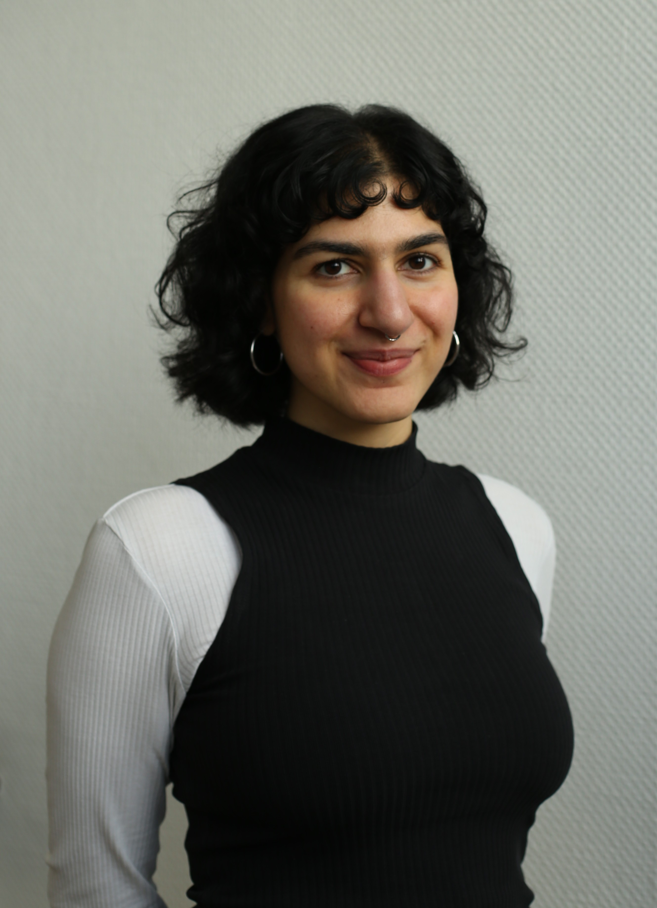
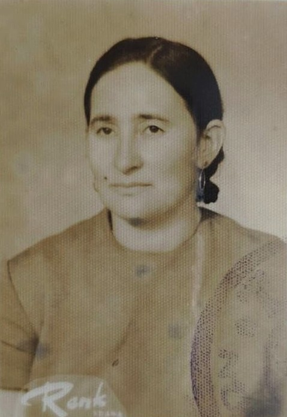

Mein Name ist Selin Göktaş. Ich bin Masterstudierende der Medienwissenschaft und Gender Studies an der Ruhr-Universität Bochum und gehöre, wie viele meiner Kommiliton:innen aus dem Ruhrgebiet, zur ersten in Deutschland geborenen Generation von sogenannten Gastarbeitenden aus der Türkei. Schon als Kind stellte ich viele Fragen zu meinem familiären Hintergrund. Bis heute erzählt mir meine mittlerweile 95-jährige Großmutter von ihrer Ankunft in Deutschland, vor allem aber von ihrer ermüdenden Fließbandarbeit beim Metallwerk *Seppelfricke* in Gelsenkirchen. Als Erstakademikerin der Familie ist es ein Privileg, mich wissenschaftlich mit ihrer intersektionalen Situierung als *Fremde*, Arbeiterin, Hausfrau und Mutter von sieben Kindern zu beschäftigen. Es ist eine fast unsichtbare geteilte Lebenserfahrung von *Gastarbeiterinnen*, die es verdient, sichtbar gemacht und geehrt zu werden. 

Selin Göktaş. © privat.

 Meine Großmutter Hamide May (geboren 01.01.1931 in Adana/Türkei). © privat.

## Über den Kurs

Die Webseite ist im Rahmen des Projektseminars „Theorie und Praxis digitaler Methoden: Staatliche Erinnerungspolitik und digitale Archive" von Jun.-Prof. Dr. Johannes Paßmann und Mika Schories an der Ruhr-Universität Bochum entstanden.

::: {.no-justify}
## Impressum

**Ruhr-Universität Bochum**

Autorin der Seite: Selin Göktas\
selin.goektas\@ruhr-uni-bochum.de

**Kontakt**

Jun.-Prof. Dr. Johannes Paßmann\
Institut für Medienwissenschaft\
Raum GB 1/49\
Universitätsstr. 150\
44801 Bochum\
Tel.: +49 234 32-24761
:::
